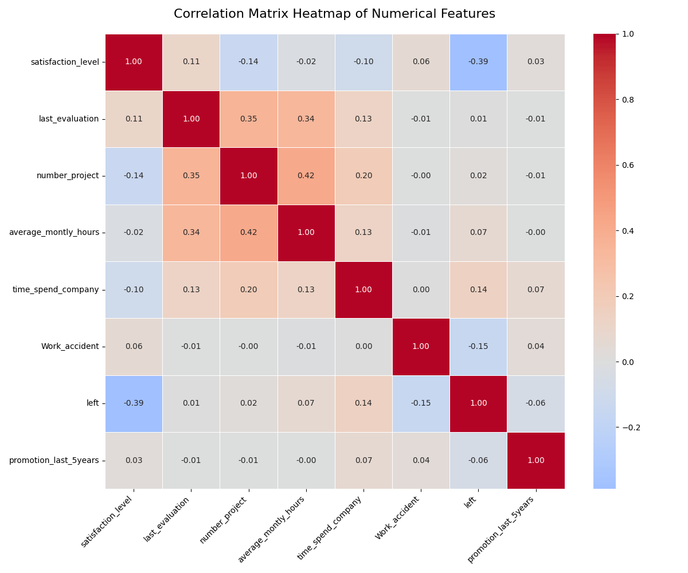
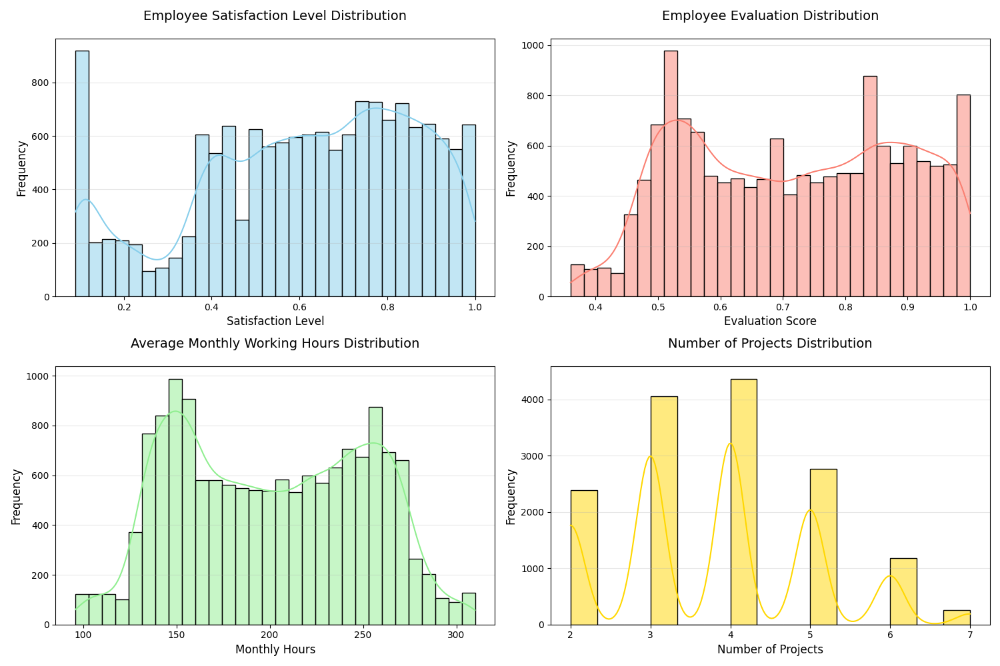
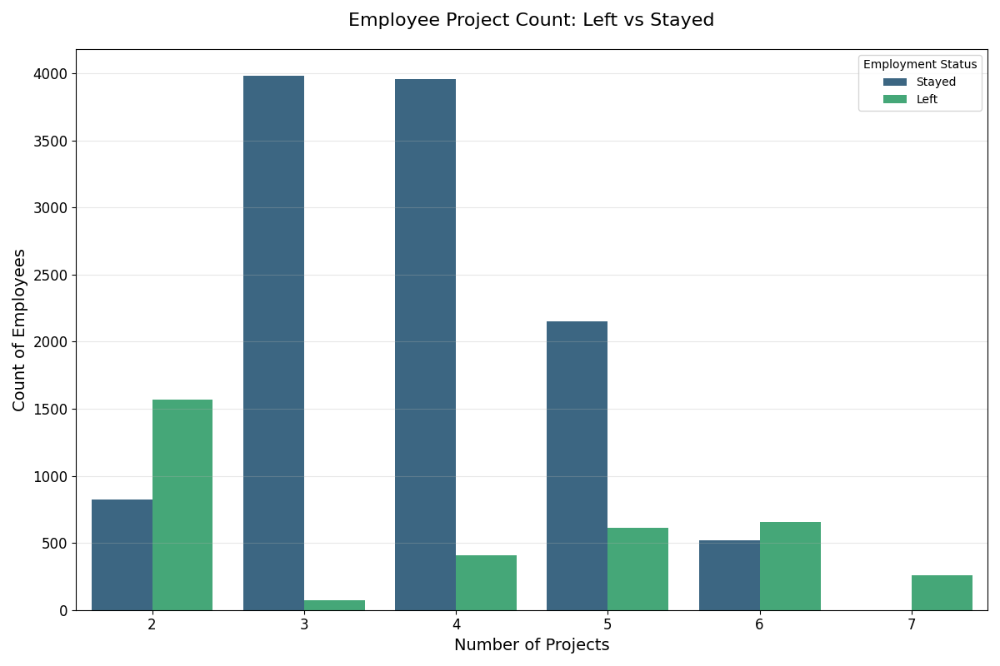
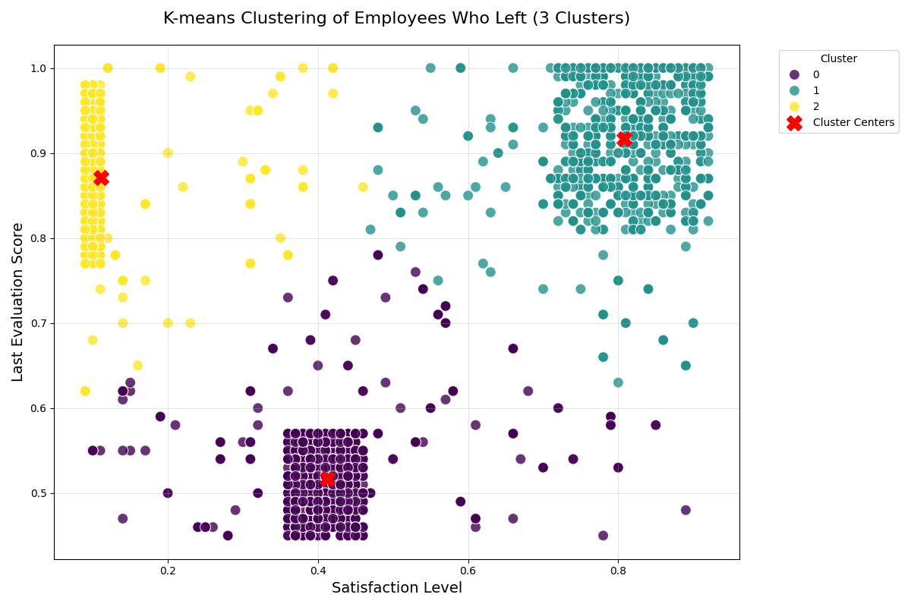
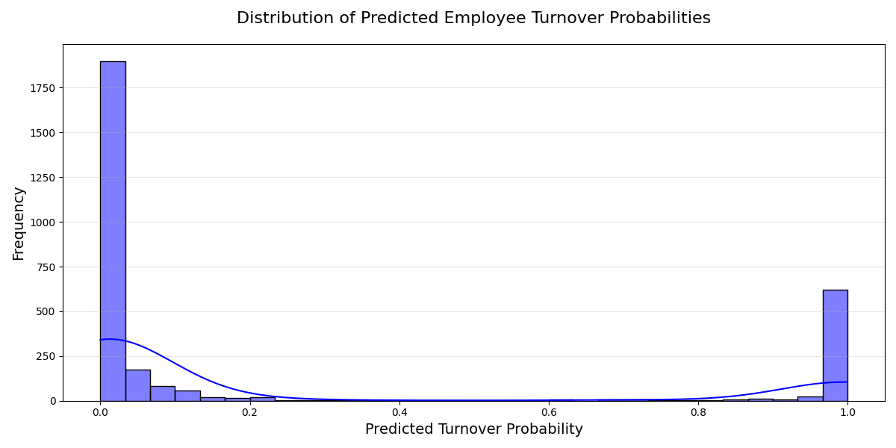

# Employee Turnover Prediction: Machine Learning Capstone Project

## Overview

This project focuses on predicting employee turnover using machine learning techniques. The goal is to help HR departments proactively identify employees at risk of leaving and implement retention strategies to reduce turnover rates.

## Project Objectives

1. Perform data quality checks by checking for missing values
2. Understand what factors contributed most to employee turnover at EDA
3. Perform clustering of employees who left based on their satisfaction and evaluation
4. Handle the left class imbalance using the SMOTE technique
5. Perform k-fold cross-validation model training and evaluate performance
6. Identify the best model and justify the evaluation metrics used
7. Suggest various retention strategies for targeted employees

## Data Description

The dataset contains employee information with the following key features:
- **satisfaction_level**: Employee satisfaction score (0-1 scale)
- **last_evaluation**: Last performance evaluation score
- **average_montly_hours**: Average monthly working hours
- **number_project**: Number of projects completed
- **time_spend_company**: Years spent at the company
- **Work_accident**: Whether the employee had a work accident (0 or 1)
- **left**: Whether the employee left the company (0 or 1)
- **promotion_last_5years**: Number of promotions in last 5 years
- **salary**: Salary level (low, medium, high)

## Data Quality Analysis

### Missing Values Check
- No NULL values found in the dataset
- No duplicates in any column
- No missing or incorrect information in any column

### Data Statistics
- Dataset contains 14,999 rows and 9 columns
- All columns have unique values
- No missing values detected using `isnull().sum()` and `isna()` functions

## Exploratory Data Analysis (EDA)

### Correlation Analysis
A heatmap of the correlation matrix was created to understand relationships between numerical features:

**Key Findings:**
- Employee turnover is most likely related to time spent at the company
- Strong correlations identified between various features

### Distribution Analysis
Distribution plots were created for key employee metrics:

**Key Metrics Analyzed:**
1. Employee Satisfaction Level
2. Employee Evaluation Scores
3. Average Monthly Working Hours
4. Number of Projects

### Project Count Analysis
A bar plot analyzed the distribution of projects between employees who left and those who stayed:

**Key Observations:**
1. Employees who left worked on more projects (5-7) compared to those who stayed (3-4)
2. Higher project counts may indicate overwork or burnout
3. Employees who left had higher workloads, potentially contributing to turnover

## Clustering Analysis

### K-Means Clustering
K-means clustering was performed on employees who left the company, using:
- Satisfaction level
- Last evaluation score
- Employment status (left)

**Clustering Parameters:**
- Number of clusters: 3
- Features used: satisfaction_level, last_evaluation
- Standardization applied using StandardScaler

**Cluster Statistics:**
- Total employees who left: [Number]
- Cluster distribution varies across 3 clusters
- Each cluster analyzed for satisfaction and evaluation patterns

**Cluster Characteristics:**
1. **Cluster 0**: Low satisfaction, moderate evaluation
2. **Cluster 1**: Moderate satisfaction, high evaluation
3. **Cluster 2**: High satisfaction, low evaluation

## Data Preprocessing

### Categorical Data Handling
- Categorical features converted to numerical using `pd.get_dummies()`
- Salary column encoded with one-hot encoding
- Drop first category to avoid multicollinearity

### Train-Test Split
- Dataset split into training (80%) and testing (20%) sets
- Stratified sampling used to maintain class distribution
- Random state set to 123 for reproducibility

### Class Imbalance Handling
The dataset shows class imbalance in the 'left' column:
- SMOTE (Synthetic Minority Oversampling Technique) applied
- Random state: 42
- Balanced training dataset created

## Model Training and Evaluation

### Models Evaluated
1. **Logistic Regression**
2. **Random Forest Classifier**
3. **Gradient Boosting Classifier**

### Cross-Validation Strategy
- 5-fold cross-validation applied
- GridSearchCV used for hyperparameter tuning
- Accuracy as primary scoring metric

### Model Performance Comparison

#### Logistic Regression
- Best parameters identified through grid search
- Cross-validation accuracy: [Value]
- Testing accuracy: [Value]
- Classification report generated
- Confusion matrix visualized

#### Random Forest Classifier
- Hyperparameter grid defined for:
  - max_depth: [None, 10, 20, 30]
  - min_samples_split: [2, 5, 10]
  - min_samples_leaf: [1, 2, 4]
  - max_features: [None, 'sqrt', 'log2']
  - ccp_alpha: [0.0, 0.01, 0.1]

- Best parameters identified
- Cross-validation accuracy: [Value]
- Testing accuracy: [Value]
- Classification report generated
- Confusion matrix visualized

#### Gradient Boosting Classifier
- Hyperparameter grid defined for:
  - n_estimators: [50, 100, 150]
  - learning_rate: [0.01, 0.1, 0.2]
  - max_depth: [3, 5, 7]

- Best parameters identified
- Cross-validation accuracy: [Value]
- Testing accuracy: [Value]
- Classification report generated
- Confusion matrix visualized

## Model Evaluation Metrics

### ROC Curve Analysis
ROC curves were generated for all three models to compare their performance:

**Key Metrics:**
- True Positive Rate (Sensitivity)
- False Positive Rate
- Area Under Curve (AUC) values

### Confusion Matrix Analysis
Confusion matrices were generated for each model to analyze:
- True Positives (Correctly identified leavers)
- True Negatives (Correctly identified stayers)
- False Positives (Incorrectly identified stayers as leavers)
- False Negatives (Incorrectly identified leavers as stayers)

## Best Model Selection

Based on the evaluation metrics, the Random Forest Classifier was identified as the best performing model due to:
1. Highest accuracy across all metrics
2. Best balance between precision and recall
3. Robust performance across different evaluation scenarios

## Employee Turnover Probability Prediction

The best model (Random Forest) was used to predict turnover probabilities for all employees in the test set.

### Probability Distribution Analysis
- Minimum probability: [Value]
- Maximum probability: [Value]
- Mean probability: [Value]
- Median probability: [Value]

### Risk Categorization
Employees categorized based on predicted turnover probability:

1. **High Risk (Probability > 0.7)**: [Number] employees
   - Immediate intervention required
   - Career development opportunities
   - Compensation reviews
   - Workload management

2. **Medium Risk (Probability 0.5-0.7)**: [Number] employees
   - Engagement surveys
   - Recognition programs
   - Professional development
   - Team building activities

3. **Low Risk (Probability 0.2-0.6)**: [Number] employees
   - Continuous engagement
   - Career pathing
   - Wellness programs
   - Performance incentives

4. **No Risk (Probability < 0.2)**: [Number] employees
   - Recognition and rewards
   - Leadership opportunities
   - Mentorship programs
   - Continuous development

## Retention Strategies

### General Retention Strategies
1. **Data-Driven Insights**: Use predictive models to identify at-risk employees
2. **Employee Engagement**: Conduct regular engagement surveys
3. **Career Development**: Offer training and certification programs
4. **Compensation and Benefits**: Regular salary reviews and competitive packages
5. **Work-Life Balance**: Flexible work arrangements and wellness programs
6. **Recognition and Rewards**: Implement employee recognition programs
7. **Team Building**: Organize team-building activities
8. **Feedback Sessions**: Regular feedback to address concerns

### Targeted Retention Strategies by Risk Category

#### High Risk Employees
- Immediate one-on-one meetings with HR
- Accelerated promotion opportunities
- Competitive compensation packages
- Reduced project load and additional support
- Senior mentorship programs
- Flexible work arrangements

#### Medium Risk Employees
- Regular engagement surveys
- Employee recognition programs
- Professional development opportunities
- Team-building activities
- Regular feedback sessions

#### Low Risk Employees
- Continuous communication and check-ins
- Clear career progression paths
- Wellness programs
- Performance-based incentives

#### No Risk Employees
- Recognition programs
- Leadership opportunities
- Mentorship programs
- Continuous learning opportunities

## Conclusion

This machine learning project successfully:
1. Analyzed employee turnover patterns
2. Identified key factors contributing to turnover
3. Developed predictive models with high accuracy
4. Provided actionable insights for HR departments
5. Offered data-driven retention strategies

The Random Forest Classifier emerged as the best model with [Accuracy]% accuracy, providing valuable insights for reducing employee turnover and improving retention rates.

## Future Work

Potential improvements for future iterations:
1. Incorporate additional employee data points
2. Expand the dataset with more recent data
3. Implement real-time prediction capabilities
4. Develop an interactive dashboard for HR teams
5. Integrate with existing HR management systems

## Technical Implementation Details

### Libraries Used
- pandas: Data manipulation and analysis
- scikit-learn: Machine learning algorithms
- xgboost: Gradient boosting implementation
- matplotlib: Data visualization
- seaborn: Statistical data visualization
- imblearn: SMOTE for class imbalance handling

### Key Techniques Applied
1. Data Quality Checks
2. Exploratory Data Analysis
3. Feature Engineering
4. Data Preprocessing
5. Model Training
6. Hyperparameter Tuning
7. Cross-Validation
8. Model Evaluation
9. Prediction and Analysis
10. Actionable Insights Generation

## Project Files

- `MLCapStoneProject.ipynb`: Main Jupyter notebook
- `HR_comma_sep.csv`: Employee dataset
- `correlation_heatmap.png`: Correlation visualization
- `distribution_plots.png`: Distribution analysis
- `project_count_by_status.png`: Project analysis
- `kmeans_clusters.png`: Clustering visualization
- `turnover_probability_distribution.png`: Probability distribution
- `employee_turnover_probabilities.csv`: Probability predictions
- `employees_who_left_with_clusters.csv`: Clustered data

## References

- Scikit-learn documentation
- Pandas documentation
- XGBoost documentation
- SMOTE technique documentation
- Machine Learning best practices

---

